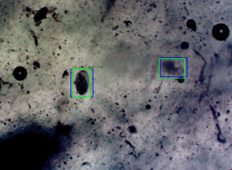

<div align="center">
# Automated Detection of Nematode Eggs

This repository contains main scripts, and documentation for the automated detection of nematode eggs using deep learning. 

The project supports training, fine-tuning, evaluation, prediction, and visualisation for Faster R-CNN, YOLOv8s and DeepLabV3+ models.



</div>

[](https://creativecommons.org/licenses/by-nc-nd/4.0/)
[](https://github.com/shion92/automated-detection-of-nematode-Eggs-/stargazers)
[](https://github.com/shion92/automated-detection-of-nematode-Eggs-/issues)

---

## Folder Structure 

This Git repository does not include image, CSV, or other data files. To access these, please send a request to shionshine@gmail.com. 

```
automated-detection-of-nematode-Eggs-/
├── Data/                  # Raw microscopic images and annotation files
├── dataset/               # Processed datasets (train/val/test splits, YOLO labels, DeepLab masks etc.)
│   ├── test
│   │   ├── annotaions     # .xml files for bounding box annotations
│   │   ├── images         # .tif image files
│   │   ├── json           # .json files. Faster RCNN training requires.
│   │   ├── labels         # .txt files. YOLO training requires.
│   │   └── masks          # .png files. DeepLab training requires. 
│   ├── train
│   │   └── ...
│   ├── val
│   │   └── ...
├── DeepLab/               # DeepLabV3+ segmentation scripts and configs
│   ├── deeplab_training.py        # Training or fine-tuning 
│   ├── evaluate_visual_deeplab.py # Perform evaluation + visualisation 
│   ├── inference_deeplab_model.py # Run prediction separately if needed (it's usually integrated with training)
│   └── ...
├── Faster_rcnn/           # Faster R-CNN detection scripts and configs
│   ├── faster_rcnn.py
│   ├── evaluate_visual_faster_cnn.py
│   ├── inference_faster_rcnn.py
│   └── ...
├── YOLO/                  # YOLOv8 training scripts
│   ├── yolo_training.py
│   ├── evaluate_YOLO.py
│   ├── visual_yolo_prediction.py 
│   └── ...
├── Processed_Images/      # Model predictions and visualisations
├── model/                 # Saved model weights and checkpoints
├── Helper/                # Utility functions, particularly for converting .tif image files into formats suitable for training
│   ├── split_prep_sample.py
│   └── ...
├── evaluation/            # Evaluation metrics, running logs and Tensorboard logs
├── README.md              # Project documentation (this file)
└── requirements.txt       # Python dependencies
```


---

## Main Components

### 1. **Data Preparation for Training **
- Script in `Helper/` to split raw data into train/val/test sets 
- Convert images to formats that suitable for training (e.g., Pascal VOC XML to YOLO readable .txt, etc.).

### 2. **Model Training & Tuning**
- **Faster R-CNN:**  
  - `Faster_rcnn/faster_rcnn.py` for training and fine-tuning with different learning rates and backbones.
- **YOLOv8:**  
  - `YOLO/yolo_training.py` for training YOLOv8 models with various hyperparameters and optimisers.
- **DeepLabV3+:**  
  - `DeepLab/deeplab_training.py` for segmentation training.

### 3. **Inference & Prediction**
- `inference_faster_rcnn.py` for example, is a script for running inference on trained models and saving predictions. It is built to run inference separately if needed, which usually is already integrated into the training pipeline. 
- Outputs are typically saved in `/Processed_Images`

### 4. **Evaluation & Visualization**
- `DeepLab/evaluate_visual_deeplab.py`, `faster_rcnn/evaluate_visual_faster_cnn.py` etc for evaluating predictions (precision, recall, F1, mAP, PR curves). Outputs are typically saved in `evaluation`.
- For YOLO, TensorBoard was used to compare different YOLO model variants.


---
## How to Use
**Install Dependencies**

Ensure Python 3.11.9 is installed, then install the required packages:

```bash
   pip install -r requirements.txt
```

---
## Debug notes

- Adjust paths and hyperparameters as needed for your experiments.
- Refers to Helper/label_instruction.md if you have any questions around labeling. 

---

## Contact
For questions or contributions, please contact Jacquelin Ruan at shionshine@gmail.com or open an issue or pull request.

---
